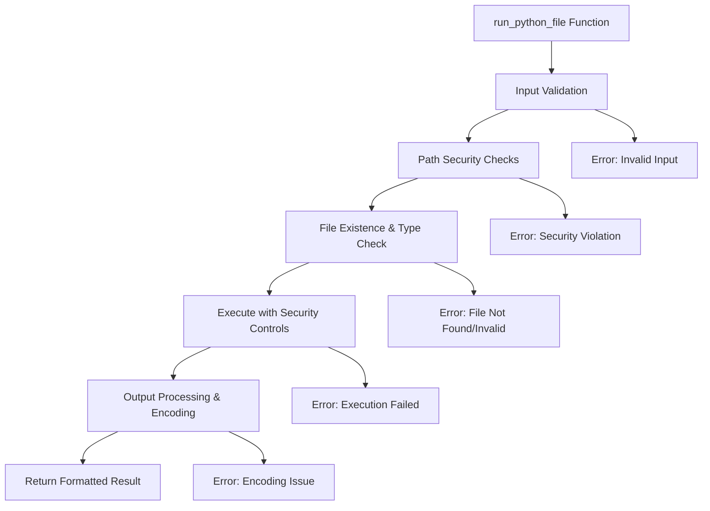

# Security Analysis and Improvement Plan for run_python_file.py

## Current Security Vulnerabilities Identified

### 1. **Command Injection Risk (Line 20)**
```python
["python", file_path], cwd=abs_working_dir
```
**Issue**: Using relative `file_path` in subprocess call instead of absolute path. While the list format provides some protection, using the absolute path is more secure.

### 2. **Missing Text Encoding Specification**
**Issue**: Lines 23-24 output `stdout` and `stderr` as bytes without proper decoding, which can lead to encoding issues and potential security problems with non-UTF-8 content.

### 3. **Python Executable Path Not Validated**
**Issue**: Using "python" assumes it's in PATH and doesn't validate which Python interpreter is being used, which could be exploited if PATH is manipulated.

### 4. **Insufficient Path Traversal Protection**
**Issue**: While there's a check for path traversal (line 9-10), it could be strengthened with additional validation.

## Proposed Security Improvements

### 1. Use Absolute Path in Subprocess Call
```python
# Current (less secure)
["python", file_path]

# Improved (more secure)
[sys.executable, abs_file_path]
```

### 2. Add Proper Text Encoding
```python
# Decode output with proper encoding handling
stdout_text = output.stdout.decode('utf-8', errors='replace')
stderr_text = output.stderr.decode('utf-8', errors='replace')
```

### 3. Use sys.executable for Python Path
```python
import sys
# Use the same Python interpreter that's running this script
[sys.executable, abs_file_path]
```

### 4. Enhanced Path Validation
```python
# Additional checks:
- Validate file extension more strictly
- Check for null bytes in path
- Normalize path before validation
- Check file permissions
```

### 5. Add Resource Limits
```python
# Consider adding:
- Memory limits
- CPU time limits
- Process limits
```

## Implementation Strategy

### Phase 1: Critical Security Fixes
1. Replace relative path with absolute path in subprocess call
2. Use `sys.executable` instead of "python"
3. Add proper text encoding for output

### Phase 2: Enhanced Validation
1. Add null byte check in file paths
2. Implement stricter file extension validation
3. Add file permission checks

### Phase 3: Resource Protection
1. Implement timeout (already present at 30 seconds)
2. Consider adding memory limits if needed
3. Add logging for security events

## Security Best Practices Applied

1. **Principle of Least Privilege**: Only allow execution of Python files within the working directory
2. **Input Validation**: Validate all inputs before processing
3. **Fail Secure**: Return errors rather than proceeding with unsafe operations
4. **Defense in Depth**: Multiple layers of security checks
5. **Explicit Over Implicit**: Use absolute paths and explicit encoding

## Testing Considerations

### Edge Cases to Test:
- Path traversal attempts (../, ..\)
- Symbolic links
- Files with special characters in names
- Non-UTF-8 encoded output
- Large output that exceeds buffer limits
- Scripts that attempt to spawn subprocesses
- Scripts with infinite loops (timeout test)

## Additional Security Recommendations

1. **Sandboxing**: Consider running subprocess in a restricted environment
2. **Logging**: Add security event logging for audit trails
3. **Input Sanitization**: Further sanitize file paths
4. **Output Limits**: Limit the amount of output captured to prevent memory exhaustion
5. **Process Isolation**: Consider using containers or VMs for complete isolation

## Code Architecture Improvements



## Summary

The current implementation has several security vulnerabilities that could be exploited. The main concerns are:
1. Using relative paths in subprocess execution
2. Missing text encoding specification
3. Not validating the Python executable path

By implementing the proposed improvements, we can significantly enhance the security of the `run_python_file` function while maintaining its functionality.