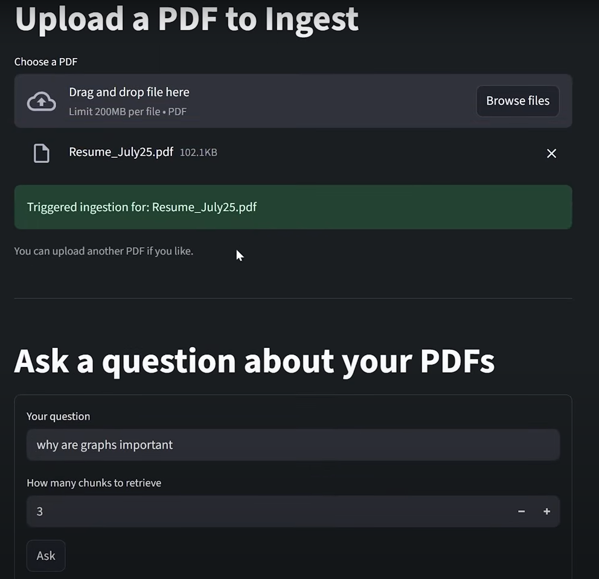
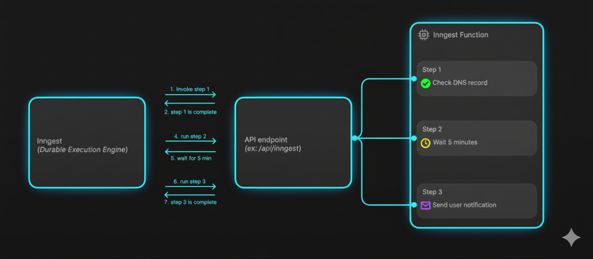

# RAG Production App

This is a Retrieval-Augmented Generation (RAG) application that uses a Streamlit frontend, a FastAPI backend, and Inngest for asynchronous job processing. It allows users to upload PDF documents and ask questions about their content.



## Features

-   **PDF Upload:** Easily upload PDF files through a web interface.
-   **Asynchronous Ingestion:** Document processing (chunking, embedding, and storing) is handled in the background by Inngest, so the UI is never blocked.
-   **Question Answering:** Ask questions about the content of your uploaded documents.
-   **Scalable Architecture:** Built with modern tools like FastAPI, Inngest, and Qdrant to handle production workloads.

## Getting Started

### Prerequisites

-   Python 3.13+
-   [uv](https://github.com/astral-sh/uv) for package management
-   [Docker](https://www.docker.com/) for running the vector database
-   [Node.js](https://nodejs.org/en) and `npx`

### Installation

1.  **Clone this repository**
    

2.  **Set up environment variables:**
    Create a `.env` file in the root of the project and add your OpenAI API key:
    ```
    OPENAI_API_KEY="sk-..."
    ```

3.  **Install Python dependencies:**
    ```bash
    # Create the virtual environment
    uv venv

    # Activate the environment
    source .venv/bin/activate

    # Install packages
    uv pip install -e .
    ```

## Running the Application

The application consists of four main components that need to be running simultaneously: the Qdrant vector database, the FastAPI backend, the Inngest development server, and the Streamlit frontend.

1.  **Start the Qdrant Docker Container:**
    This command starts a Qdrant container and mounts the local `qdrant_storage` directory to persist data.
    ```bash
    docker run -p 6333:6333 -v $(pwd)/qdrant_storage:/qdrant/storage qdrant/qdrant
    ```

2.  **Start the FastAPI Backend:**
    In a new terminal window, run:
    ```bash
    uvicorn main:app --reload
    ```

3.  **Start the Inngest Dev Server:**
    In a third terminal window, run:
    ```bash
    npx inngest-cli@latest dev -u http://127.0.0.1:8000/api/inngest --no-discovery
    ```

4.  **Start the Streamlit Frontend:**
    Finally, in a fourth terminal, run the Streamlit app:
    ```bash
    streamlit run streamlit_app.py
    ```

You can now access the web interface at **http://localhost:8501**.

## How It Works

The application uses Inngest to manage the data ingestion and querying pipelines as a series of functions. You can view the status of these jobs in the Inngest development UI.

